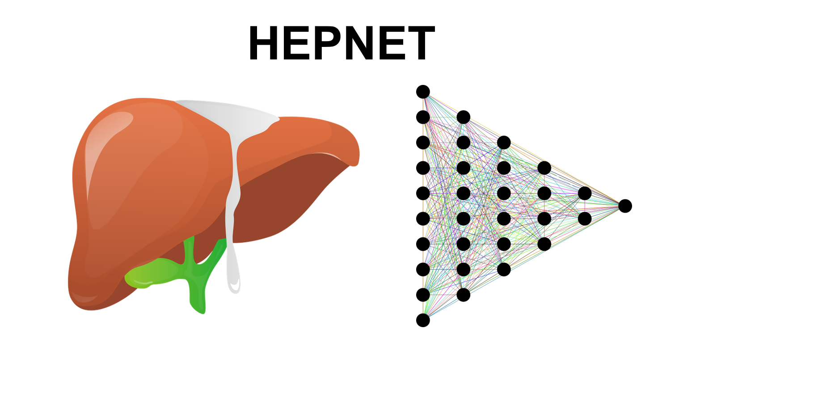

# HEPNET:HEPatic adenocarcinoma classification NETwork

We present HEPNET, a deep learning classifier for the diagnosis of hepatic adenocarcinomas on hematoxylin&eosin-stained histopathological slides.

## What is this?
This is the source code for a published deep learning model for the classification of adenocarcinomas within the liver (https://www.sciencedirect.com/science/article/pii/S0016508523048837?via%3Dihub).

## Introduction
Histopathological diagnosis of hepatic adenocarcinomas can be challenging, in particular since the liver is the most frequent site of cancer metastasis. We here provide a deep learning model capable of accurately predicting intrahepatic cholangiocarcinoma and colorectal liver metastasis as two major forms of liver adenocarcinomas directly on hematoxylin & eosin stained whole slide images. 

## Model architecture
Our model has been trained on more than 700.000 image tiles curated at the Heidelberg University Hospital. We used an EfficientNET B3 model precalibrated to ImageNet.

## How to use
The final model including its weights can be downloaded in the folder /model. It can be applied to any image tile with at least 300 x 300 pixel entry dimensions. We recommend QuPath for image partitioning and prior color normalization (via the Macenko method). The model will output a probability of the tile to represent intrahepatic cholangiocarcinoma or colorectal metastasis (sigmoid function).

## Dependencies
Linux (Tested on Ubuntu 18.04)
NVIDIA GPU (Tested on Nvidia GeForce RTX 3090)
Python (3.6), TensorFlow (version 2.6.0), Keras (version 2.6.0), Numpy (version 1.19.5), Pandas (version 1.1.5), OpenCV (version 4.5.1.48), Pillow (version 8.1.2), SciPy (version 1.5.4), scikit-learn (version 0.24.1), matplotlib (3.3.4), scikit-image (version 0.17.2) and scikit-plot (version 0.3.7).

## License
This code is made available under the MIT License and is available for non-commercial academic purposes.
